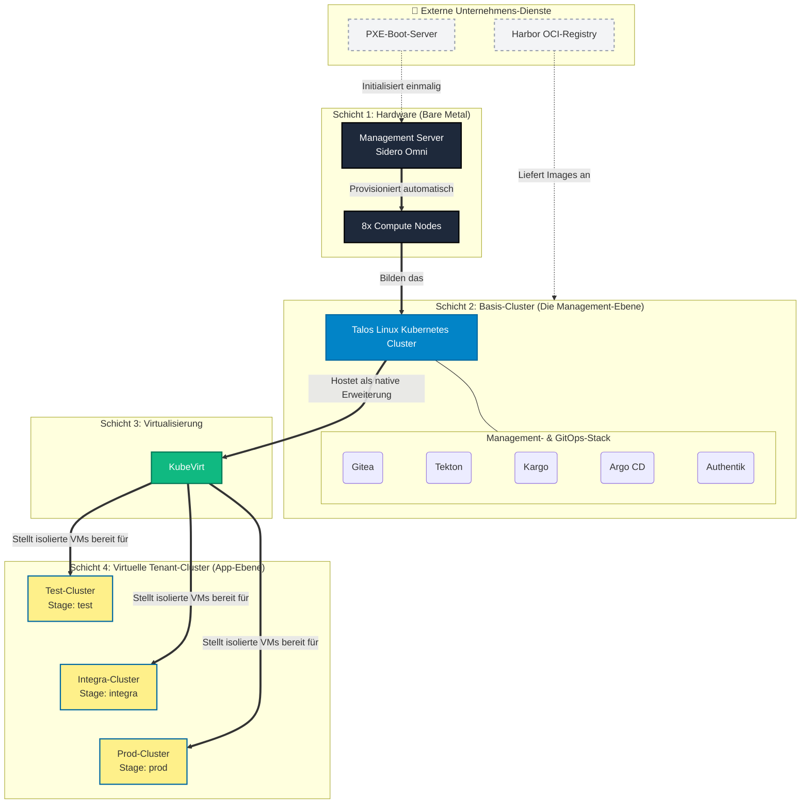

Infrastruktur-Konzept: Cloud-Native Bare-Metal IT-Labor
1. Management Summary & Einleitung
Dieses Konzept beschreibt den architektonischen Aufbau und die operativen Prozesse des neuen IT-Labors. Ziel ist die Etablierung einer modernen, hochautomatisierten und ausfallsicheren Basis, die ohne traditionelle Virtualisierungsschichten (Hypervisor) als physisches Fundament auskommt. Stattdessen wird die Kerninfrastruktur direkt auf der physischen Hardware (Bare Metal) bereitgestellt. Das Labor nutzt einen “Cluster-as-a-Service”-Ansatz, um Entwicklern und Auszubildenden sichere, isolierte Umgebungen bereitzustellen.
Die Steuerung der gesamten Umgebung erfolgt strikt nach dem “GitOps”-Prinzip. Git fungiert als die einzige und absolute Wahrheitsquelle (“Single Source of Truth”). Dies unterbindet Konfigurationsdrifts durch manuelle Eingriffe und versetzt das System in die Lage, seinen gewünschten Soll-Zustand jederzeit selbstständig und deterministisch herzustellen.
2. Infrastruktur-Design & Der Schicht-für-Schicht Aufbau
Die Hardwarebasis besteht aus einem dedizierten Management-Server, einem Compute-Server (aufgeteilt in 8 Nodes) und einem zentralen Storage-System. Die Netzwerkkonfiguration (inklusive VLANs und BGP-Routing via Cilium und MetalLB) ist so abstrahiert, dass Workloads dynamisch skalieren können. Um administrative Systeme strikt von den Nutzer-Anwendungen zu trennen, ist die Architektur in vier Schichten unterteilt:
•	Schicht 1: Hardware (Bare Metal)
Das physische Fundament, bestehend aus den unkonfigurierten Servern.
•	Schicht 2: Das physische Basis-Cluster (Management-Infrastruktur)
Der Management-Server installiert per PXE-Boot autonom das Betriebssystem Talos Linux auf den 8 Compute-Nodes. Auf diesem Basis-Cluster laufen keine Nutzer-Projekte, sondern ausschließlich die System-Tools des Labors (Tekton, Argo CD, Gitea, Kargo) sowie die Virtualisierungserweiterung KubeVirt.
•	Schicht 3: Die Virtualisierungsebene (KubeVirt)
KubeVirt greift auf die physischen Ressourcen der 8 Nodes zu, um virtuelle Maschinen (VMs) bereitzustellen.
•	Schicht 4: Virtuelle Tenant-Cluster (Workload-Ebene)
Sobald das Basis-Cluster operativ ist, werden über KubeVirt drei getrennte, virtuelle Kubernetes-Cluster mit eigenen Control Planes erstellt. Diese dienen als exakte Zielumgebungen für die logischen Release-Stages:
•	Test-Cluster: Hier läuft die Stage  test  (für erste funktionale Code-Prüfungen).
•	Integra-Cluster: Hier läuft die Stage  integra  (für Integrationstests mit angebundenen Systemen/Datenbanken).
•	Prod-Cluster: Hier läuft die Stage  prod . Ausschließlich hier werden die finalen, produktiven Live-Anwendungen für die Nutzer betrieben.
3. Repository-Architektur & GitOps-Struktur
In Gitea wird die Code-Basis logisch in unterschiedliche Bereiche geteilt. Um eine saubere und skalierbare Struktur zu gewährleisten, gelten strenge Vorgaben für die Trennung und Benennung der Repositories.
A. Das Plattform-Repository (1 Repo für die Kerninfrastruktur)
Für das Basis-Cluster des Labors existiert ein einziges Konfigurations-Repository. Hier liegen die Manifeste zur Installation der Basis-Tools (Argo CD, KubeVirt etc.). Da diese Tools von Open-Source-Herstellern gebaut werden, kompilieren wir hier keinen eigenen Quellcode.
B. Das Zwei-Repo-Prinzip (2 Repos pro Nutzer-Projekt)
Für jedes Projekt (z.B. ein Projekt namens  akl ), in dem Entwickler im Labor selbst Code schreiben, werden zwingend zwei getrennte Repositories mit festen Namenskonventionen angelegt:
1.	Das App-Repository (z. B.  akl-app  oder  akl-src ): Hier arbeiten die Entwickler (z. B. Python-Code, Assets, Dokumentation). Nur hierauf reagiert die Build-Pipeline (Tekton).
2.	Das Config-Repository (z. B.  akl-config  oder  akl-gitops ): Hier liegen die Kubernetes-Manifeste, die festlegen, wie die Applikation laufen soll. Entwickler haben hier nur Leserechte; automatisierte Tools (Kargo) schreiben hier neue Release-Versionen hinein.
C. Das “Single-Repo-mit-Branches” Anti-Pattern
Häufig wird beim Einstieg in GitOps der Versuch unternommen, App-Code und Infrastruktur-Manifeste in einem einzigen Repository zu bündeln und lediglich durch feste Branches (z. B.  main  für Code,  env-prod  für Konfiguration) zu trennen. Dieser Ansatz gilt im Enterprise-Umfeld als massives Anti-Pattern (Fehlarchitektur) und wird aus folgenden technischen Gründen kategorisch ausgeschlossen:
•	Der Performance-Tod von Argo CD: Argo CD muss den Soll-Zustand kontinuierlich (alle paar Minuten) aus Git auslesen. Ein App-Repository mit Code, Assets und langer Historie wird schnell hunderte Megabyte groß. Zwingt man Argo CD, bei jedem Abgleich das gesamte App-Repo in den Arbeitsspeicher zu klonen, nur um eine winzige YAML-Datei im Config-Branch zu lesen, kollabiert die Performance des Management-Clusters. Getrennte Config-Repos sind extrem klein (wenige Kilobyte) und garantieren pfeilschnelle Synchronisierungen.
•	Architektonische Git-Semantik: Branches existieren in Git primär dazu, parallele Versionen desselben Codes zu entwickeln, um sie später wieder zusammenzuführen (Merge). App-Code und Kubernetes-Manifeste dienen jedoch völlig unterschiedlichen Zwecken und werden niemals gemergt. Sie in Branches desselben Repositories zu erzwingen, führt unweigerlich zu fehleranfälligen “Orphan Branches” (Branches ohne gemeinsame Historie).
•	Verzeichnis-Struktur statt Branch-Chaos: Tools wie Kargo und Kustomize (Progressive Delivery) verwalten Stages ( test ,  integra ,  prod ) nach Best-Practice in Verzeichnissen (sogenannten Overlays), nicht in Branches. Liegen alle Stages im selben Config-Repository als Verzeichnisbaum nebeneinander, können Administratoren die Unterschiede zwischen der Test- und Prod-Umgebung auf einen Blick nebeneinander vergleichen. Müsste man hierfür ständig zwischen Git-Branches hin- und herwechseln, wird das Troubleshooting im Notfall extrem unübersichtlich.
•	Blast Radius (Explosionsradius): Bei einer Kompromittierung des Build-Tokens (Tekton) oder einem fehlerhaften Skript im Code-Branch ist bei einem Ein-Repo-Ansatz potenziell auch die produktive Konfiguration gefährdet. Physisch getrennte Repositories garantieren eine harte Systemgrenze: Das App-Repo kann das Config-Repo niemals infizieren.
Die physische Trennung in zwei Repositories eliminiert Endlosschleifen, sichert die granulare Rechteverwaltung und hält die Infrastruktur-Historie (“Audit Log”) frei von Entwickler-Commits.
4. Technologie-Entscheidungen im Detail
Talos Linux & Sidero Omni
Im klassischen Betrieb erfordern Standard-Betriebssysteme kontinuierliches Patch-Management und die Absicherung von Benutzerzugängen. Talos Linux ist ein minimales Betriebssystem exklusiv für Kubernetes. Lokale Logins oder Shell-Zugänge existieren architektonisch nicht. Sidero Omni nutzt die API, um das Basis-Cluster vollautomatisch zu provisionieren.
KubeVirt (Cluster-as-a-Service)
KubeVirt erstellt VMs auf dem Basis-Cluster, die als isolierte Control Planes und Worker Nodes für die virtuellen Tenant-Cluster dienen. Verursacht ein Team einen Absturz seines virtuellen Clusters, bleibt das Basis-Cluster unberührt. Zusätzlich können bei Bedarf klassische Legacy-VMs nahtlos in derselben Umgebung betrieben werden.
Gitea
Als quelloffene Lösung bietet Gitea vollständige Datensouveränität ohne Lizenzkosten. Es ist ressourcenschonend und bildet als “Single Source of Truth” das Fundament für das gesamte GitOps-Setup.
Tekton
Tekton übernimmt die Continuous Integration (CI). Im Vergleich zu klassischen Lösungen wie Jenkins arbeitet Tekton Cloud-nativ: Jenkins operiert oft als zentraler, monolithischer Server, der dauerhaft läuft, Dateireste ansammelt und wartungsintensiv ist. Tekton hingegen skaliert effizient: Für jeden Commit im App-Repository erstellt es einen frischen, isolierten Build-Pod im Basis-Cluster. Nach dem Bauen des Images wird der Pod restlos gelöscht.
Externe OCI-Registry (Harbor)
Die Container-Images werden in der bestehenden Harbor-Registry des Unternehmens abgelegt, was den internen Wartungsaufwand für Storage, Backups und Vulnerability-Scanning vollständig eliminiert. Wir stellen lediglich die Anbindung bereit. Sollten sich die Anforderungen des Labors ändern, bietet die Architektur die Flexibilität, perspektivisch jederzeit eine eigene lokale Registry in das Cluster zu integrieren.
Kargo & Argo CD (Stages & Auslieferung)
Argo CD synchronisiert den gewünschten Zustand aus dem Config-Repository auf die virtuellen Cluster. Kargo sitzt als übergeordnete Kontrollinstanz (“on top”) auf dem Basis-Cluster und verwaltet intern die logischen Release-Stages. Kargo überwacht den Harbor, testet neue Images und steuert exakt, wann ein Image in welche Stage befördert wird, indem es das Config-Repository anpasst.
Authentik
Authentik fungiert als lokaler Identity Provider (IdP) für das Labor, da kein externes LDAP direkt nutzbar ist. Es ermöglicht modernes Single Sign-On (SSO) und emuliert über den integrierten LDAP Outpost ein klassisches LDAP-Verzeichnis für ältere Anwendungen.
5. Workflow-Integration & Progressive Delivery
Kargo orchestriert das stufenweise Ausrollen (“Progressive Delivery”) von Software. Kargo nutzt intern eine  base -Konfiguration (den allgemeinen Grundbauplan der App) und erweitert diesen pro Stage. Dieser Prozess garantiert, dass produktive Workloads streng geschützt bleiben:
1.	Code Commit: Änderung im App-Repository in Gitea.
2.	Build (Tekton): Tekton baut das Container-Image und pusht es in den externen Harbor.
3.	Stage “Test”: Kargo erkennt das neue Image im Harbor. Kargo nimmt den  base -Bauplan, fügt das neue Image hinzu und schreibt dies als neuen Status für die Stage  test  ins Config-Repository. Argo CD liest dies und installiert die App auf dem virtuellen Test-Cluster.
4.	Stage “Integra”: Wenn die erste Testphase erfolgreich war, befördert Kargo das Image in die nächste Stufe. Es aktualisiert den Status für die Stage  integra  im Config-Repo. Argo CD synchronisiert dies auf das virtuelle Integra-Cluster (für Schnittstellentests).
5.	Stage “Prod” (Produktivbetrieb): Nach der finalen Freigabe schreibt Kargo das Update für die Stage  prod  ins Config-Repo. Argo CD rollt diese finale Version auf das virtuelle Prod-Cluster aus. Ausschließlich hier verarbeiten die produktiven Anwendungen echte Nutzeranfragen

7. Glossar
•	App-Repository: Ablage, in der ausschließlich der Programmiercode der Entwickler liegt.
•	Bare Metal: Software-Installation direkt auf der physischen Hardware ohne den Einsatz eines Hypervisors.
•	CI/CD: Continuous Integration (automatisierte Tests/Builds) und Continuous Delivery (Ausrollen).
•	Cluster-as-a-Service: Die Bereitstellung isolierter Kubernetes-Cluster als VMs über KubeVirt.
•	Config-Repository: Ablage für die Infrastruktur-Konfigurationen (Manifeste) einer Anwendung.
•	GitOps: Betriebsmodell, bei dem Git als einzige Wahrheitsquelle für die Konfiguration dient.
•	KubeVirt: Erweiterung zum Betrieb von virtuellen Maschinen als native Ressourcen in Kubernetes.
•	LDAP: Ein Netzwerkprotokoll zur Abfrage in verteilten Verzeichnisdiensten (Benutzerrechte).
•	OCI-Registry: Standardisierter Speicherort für Container-Images (hier: die externe Harbor-Instanz).
•	Progressive Delivery: Das stufenweise Ausrollen von Software über definierte Stages ( test  ->  integra  ->  prod ).
-   PXE-Boot: Das netzwerkbasierte Laden des Betriebssystems für Bare-Metal-Server.